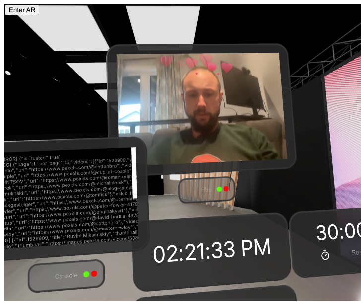

# SpatialJS Stage Example

<p align="center">
  
</p>

<h3 align="center">Create a SpatialJS Stage Example</h3>

<br/>

Built with ❤️ by [Deamoner](https://twitter.com/spatialmatty) | [Personal Site](https://mattydavis.ca/) | [YouTube](https://www.youtube.com/@mattjdavis) | [Medium](https://medium.com/@mdavis-71283) | [Discord](https://discord.gg/tKNwtpDVJn)

## Live Demo

You can try out this project live on CodeSandbox:

[](https://codesandbox.io/p/github/Deamoner/spatialjs-stage-example/main?import=true)

This live demo allows you to explore the interactive spatial room with the wall-jumping music player directly in your browser.

## Base Libraries

This project is built using the following:

- [SpatialJS](https://github.com/Deamoner/spatialjs) - A framework for building spatial user interfaces
- [@spatialjs/core](https://www.npmjs.com/package/@spatialjs/core) - Core package for SpatialJS
- [SpatialJS Documentation](https://spatialjs.dev/) - Official documentation and guides

These libraries provide the foundation for creating interactive 3D spatial environments with React and Three.js.

## Getting Started

1. Clone this repository
2. Install dependencies:

```bash
npm install
```

3. Run the development server:

```bash
npm run dev
```

Now you should be able to run the completed project without issue.

## Support

For questions, bug reports, or feature requests, please open an issue on our [GitHub repository](https://github.com/Deamoner/spatialjs).

---

Built with ❤️ by [Deamoner](https://twitter.com/spatialmatty) | [Personal Site](https://mattydavis.ca/) | [YouTube](https://www.youtube.com/@mattjdavis) | [Medium](https://medium.com/@mdavis-71283) | [Discord](https://discord.gg/tKNwtpDVJn)
